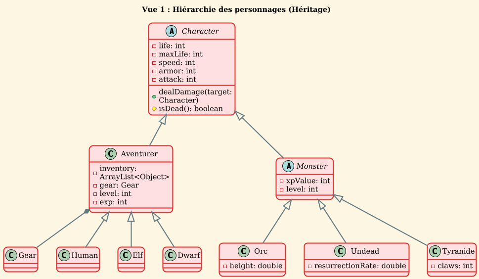
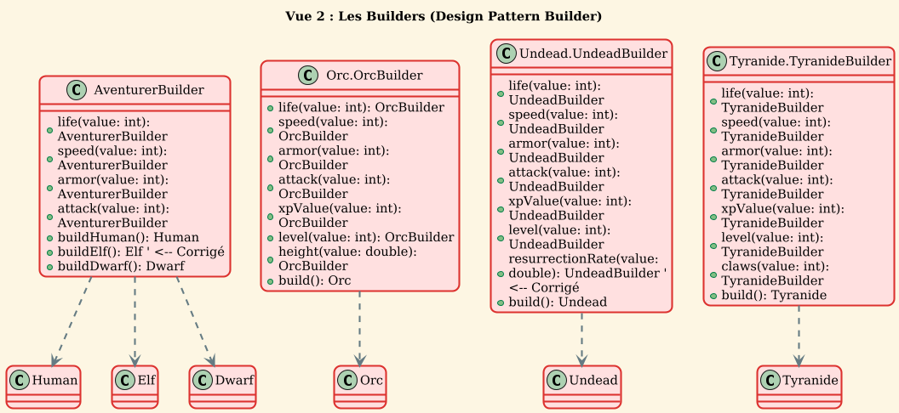
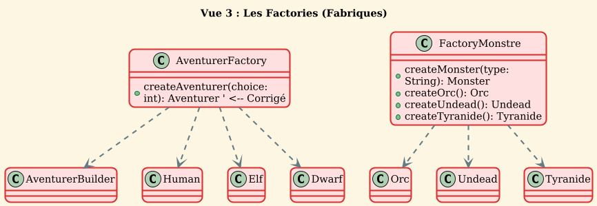
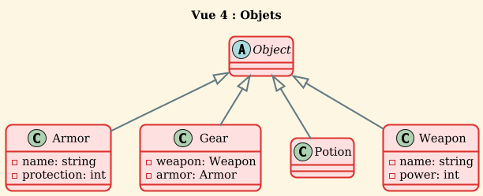

# Diagramme de classe UML final 

# Analyse de l'Architecture et Design Patterns

Ce document recense les différents Design Patterns implémentés dans le projet JavaGradle et explique les raisons de leur utilisation.

## 1. Builder Pattern (Monteur)

**Fichiers concernés :** 
- `AventurerBuilder.java`
- `ObjectBuilder.java`
- Classes internes dans `Orc.java`, `Undead.java`, `Tyranide.java`

**Description :**
Le pattern Builder est utilisé pour séparer la construction d'un objet complexe de sa représentation. Il permet de construire un objet étape par étape.

**Pourquoi l'avoir utilisé ?**
- **Lisibilité du code :** Les classes comme `Aventurer` ou `Monster` possèdent de nombreux attributs (vie, vitesse, armure, attaque, niveau, etc.). Le Builder permet de définir ces attributs de manière explicite et fluide (ex: `.life(100).speed(25).build()`) plutôt que d'utiliser un constructeur avec une longue liste d'arguments difficiles à lire.
- **Flexibilité de construction :** Il permet de créer différentes variations d'un même objet sans multiplier les constructeurs. Par exemple, `OrcBuilder` permet de créer un Orc avec des stats par défaut ou un Orc personnalisé très facilement.
- **Immutabilité (potentielle) :** Le Builder construit l'objet final une fois que tous les paramètres sont définis, ce qui aide à garantir que l'objet est dans un état cohérent dès sa création.

## 2. Factory Pattern (Fabrique)

**Fichiers concernés :** 
- `AventurerFactory.java`
- `ObjectFactory.java`
- `FactoryMonstre.java`

**Description :**
Le pattern Factory est utilisé pour déléguer la création d'objets à des classes dédiées, abstraire le processus d'instanciation.

**Pourquoi l'avoir utilisé ?**
- **Encapsulation de la logique de création :** Le code client (comme `App.java` ou les menus) n'a pas besoin de connaître les détails complexes de l'instanciation. Par exemple, `FactoryMonstre` gère la génération aléatoire des statistiques (`randomInt`) pour créer des monstres uniques. Le `main` appelle simplement `createOrc()` sans se soucier des calculs de stats.
- **Simplification du choix :** `AventurerFactory` permet de créer des archétypes prédéfinis (Humain, Elfe, Nain) via un simple choix (switch case), centralisant ainsi la configuration de ces classes.
- **Découplage :** Si la logique de création d'une épée change (ex: changement des dégâts de base), seule la Factory doit être modifiée, pas tout le code qui utilise des épées.

## 3. Singleton Pattern

**Fichiers concernés :** 
- `AventurerBuilder.java`
- `ObjectBuilder.java`

**Description :**
Le pattern Singleton assure qu'une classe n'a qu'une seule instance et fournit un point d'accès global à cette instance (`getInstance()`).

**Pourquoi l'avoir utilisé ?**
- **Gestion de l'instance de construction :** Dans votre implémentation, les Builders sont définis comme des Singletons (`private static ... INSTANCE`). Cela permet de réutiliser la même instance de l'outil de construction à travers l'application, évitant l'instanciation répétée de l'objet Builder lui-même.
*(Note : Attention cependant aux effets de bord si le Builder conserve un état entre deux constructions).*

## 4. Interface & Strategy (Comportement)

**Fichiers concernés :** 
- `Ideal_damage.java`
- `IseReposer.java`

**Description :**
L'utilisation d'interfaces définit des contrats de comportement que les classes doivent respecter.

**Pourquoi l'avoir utilisé ?**
- **Polymorphisme :** L'interface `Ideal_damage` est implémentée par `Aventurer` et `Monster`. Cela garantit que n'importe quelle entité du jeu possède la méthode `dealDamage`. Le moteur de jeu peut donc faire combattre deux entités sans se soucier de leur type exact (Aventurier ou Monstre).
- **Séparation des responsabilités (ISP) :** L'interface `IseReposer` n'est implémentée que par `Aventurer`. Cela permet de définir des capacités spécifiques aux héros (se soigner/se reposer) que les monstres ne possèdent pas, respectant ainsi la cohérence du monde de jeu.

## 5. Héritage et Abstraction

**Fichiers concernés :** 
- `Character.java` (Classe Abstraite)
- `Monster.java`, `Aventurer.java`

**Description :**
Une hiérarchie de classes claire est établie pour partager le code commun.

**Pourquoi l'avoir utilisé ?**
- **DRY (Don't Repeat Yourself) :** La classe abstraite `Character` centralise la gestion des points de vie, de l'armure, de la vitesse et de l'attaque. `Aventurer` et `Monster` héritent de ces fonctionnalités de base sans duplication de code.
- **Extensibilité :** `Monster` étend `Character` pour ajouter l'expérience (XP), tandis que `Aventurer` ajoute l'inventaire. Cela permet de spécialiser les comportements tout en gardant une base commune solide.

# Méthodologie et Déroulement du Projet

Cette section détaille la démarche adoptée pour transformer le prototype initial en une application Java structurée et maintenable.

## 1. Refonte et Structuration Initiale
**Constat de départ :** Le prototype Flash initial, contraint à un fichier unique, présentait des problèmes d'organisation, de lisibilité et de maintenabilité.
**Action :** Nous avons procédé à un découpage modulaire du code en créant une arborescence de fichiers claire, séparant distinctement les responsabilités :
*   Gestion des **Personnages**
*   Gestion des **Monstres**
*   Gestion des **Menus**
*   Gestion des **Interface**
*   Gestion des **Builders et Factory**

## 2. Intégration des Design Patterns
**Objectif :** Améliorer l'efficacité et respecter les standards de conception logicielle.
**Implémentation :**
*   **Création de Builders et Factories :** Pour simplifier et standardiser l'instanciation des entités (Personnages, Monstres) et des équipements, rendant le code plus robuste aux changements.
*   **Refactoring du Menu :** Décomposition du bloc monolithique initial (composé de multiples conditions et boucles imbriquées) en fonctions atomiques nommées, améliorant grandement la lisibilité du flux d'exécution.

## 3. Enrichissement Fonctionnel et Interfaces
**Évolution :** Ajout de nouvelles mécaniques de jeu (Système d'expérience, Inventaire, Fuite, Repos) en s'appuyant sur la base existante.
**Architecture :**
*   Utilisation d'**Interfaces** pour définir des contrats de comportement.
*   Ségrégation des capacités : Certaines interfaces sont communes (ex: dégâts), d'autres spécifiques (ex: `IseReposer` pour les aventuriers), garantissant une modélisation cohérente du monde.

## 4. Organisation et Workflow Git
**Stratégie de collaboration :**
*   **Travail par branches :** Chaque membre de l'équipe travaillait sur une branche distincte dédiée à une fonctionnalité spécifique.
*   **Séparation des fichiers :** Répartition des tâches pour éviter l'édition simultanée des mêmes fichiers et minimiser les conflits de fusion.
*   **Processus d'intégration :** Merge des fonctionnalités une fois terminées, suivi de tests pour valider la stabilité avant d'entamer le cycle suivant. 

# Utilisation des Outils d'Intelligence Artificielle

Cette section décrit comment les assistants IA ont été intégrés au flux de travail et leur apport spécifique au projet.

## 1. Outils Sélectionnés
*   **GitHub Copilot** (intégré via l'extension VS Code)
*   **Gemini Pro**

## 2. Domaines d'Application Principaux

### Documentation et Modélisation (PlantUML)
**Usage :** Génération automatique de la structure initiale des diagrammes UML.
**Retour d'expérience :**
*   *Limitation :* La première génération a produit un diagramme unique et monolithique, rendu illisible par la densité des relations ("flèches dans tous les sens").
*   *Adaptation :* Nous avons décidé de découper manuellement ce diagramme en plusieurs **Vues Thématiques** (Hiérarchie, Builders, Factories) pour en améliorer la lisibilité, tout en conservant la base syntaxique fournie par l'IA.

### Rédaction Technique
**Usage :** Aide à la structuration et au formatage du document `Architecture.md`, assurant une présentation professionnelle du rapport.

## 3. Philosophie de Développement
Bien que l'IA ait servi d'accélérateur pour la documentation, la majeure partie du **développement logique et de l'implémentation des Design Patterns** a été réalisée manuellement.
**Pourquoi ?**
*   Pour garantir une maîtrise totale du code source.
*   Pour faciliter la compréhension des mécanismes internes.
*   Pour simplifier le débogage et la maintenance future.