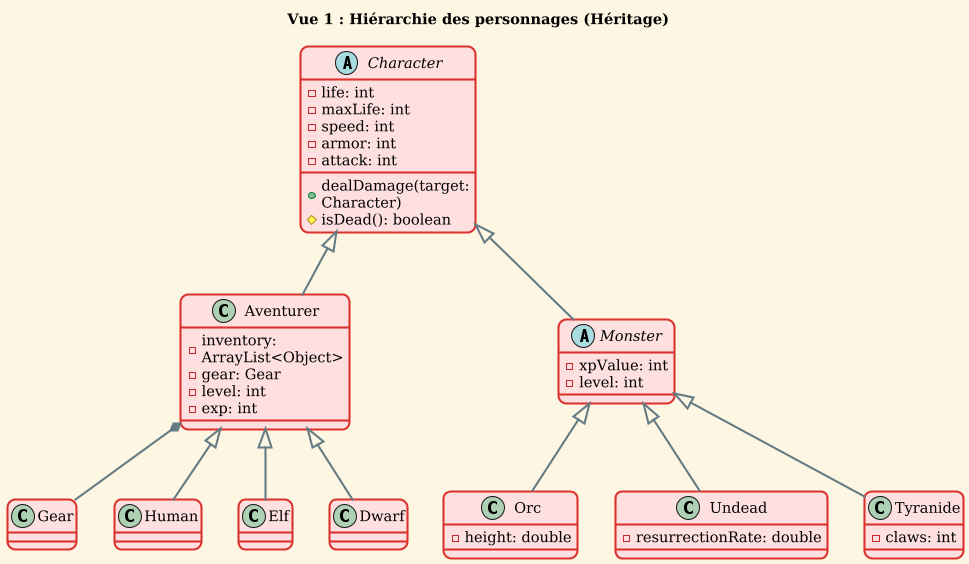
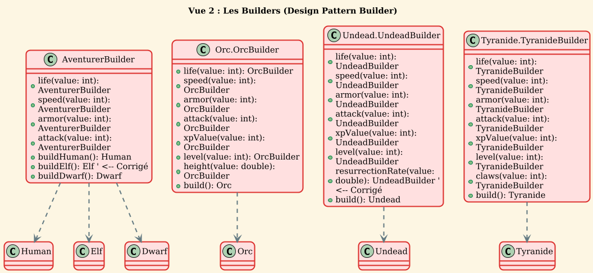
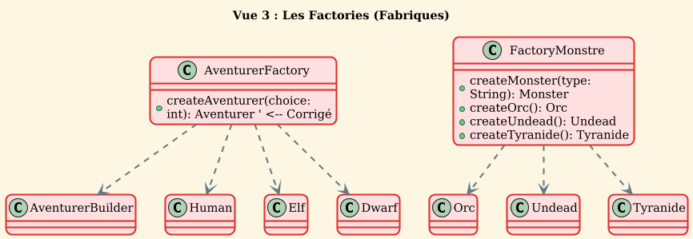

```plantuml
@startuml
!theme sunlust
title Vue 4 : Objets

abstract class Object
class Armor {
  - name: string
  - protection: int
}
class Gear {
  - weapon: Weapon
  - armor: Armor
}
class Potion
class Weapon {
  - name: string
  - power: int
}

Object <|-- Armor
Object <|-- Potion
Object <|-- Gear
Object <|-- Weapon


